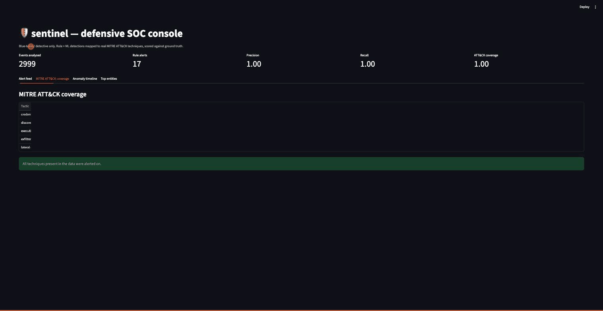

# sentinel

A defensive / blue-team SOC log-analytics pipeline. It ingests normalized security events, runs rule-based detections mapped to real MITRE ATT&CK techniques plus an unsupervised ML anomaly detector, scores detection quality against ground truth, and presents it all in a Streamlit SOC console.

## [!] Defensive-only / ethical scope

sentinel is strictly detective and blue-team. It builds detection, correlation, scoring, and visualization only. It contains no offensive tooling - no exploits, payloads, scanners, or anything with intrusion capability. The "attack scenarios" it reasons about are inert, labeled log records produced by a synthetic generator, never working attacks. Use it to practice and measure detection engineering, not to attack anything.



---

## What it does

```
labeled event stream  ->  rule engine (ATT&CK-mapped)  ->  alerts
                      ->  ML anomaly detector           ->  flagged windows
                      ->  evaluation vs. ground truth    ->  precision / recall / coverage
                      ->  Streamlit SOC console          ->  triage
```

Because the synthetic generator labels every malicious event (scenario / technique_id), detection quality is measured against ground truth rather than asserted. The label fields are read by exactly one module - the evaluation harness. Detectors and ML features read only real event fields (timestamps, users, hosts, IPs, actions, processes, byte counts). That separation is the whole point of the project.

## Detection approach

- Rule engine (detect.py / rules.py) - deterministic, windowed signatures, each citing a real ATT&CK technique. Brute force (rapid auth failures from one source then a success), lateral movement (one user to many hosts fast), suspicious process (encoded/hidden PowerShell or office-app parent), discovery (recon-command bursts), exfiltration (large outbound transfer to an external IP). Internal = RFC 1918 (10/8, 172.16/12, 192.168/16); everything else routable is external.
- ML anomaly detector (anomaly.py) - an IsolationForest over per-(user, hour) behavioral feature vectors (auth-failure count/ratio, distinct hosts/dest-IPs, bytes out, process/rare-process counts, off-hours). It catches deviating windows without hand-written signatures.
- Evaluation (evaluate.py) - the only label reader. Clusters labeled events into attack instances and scores alert precision, per-scenario recall, and ATT&CK technique coverage.

## MITRE ATT&CK mapping

| Scenario             | Technique   | Name                          | Tactic            |
| -------------------- | ----------- | ----------------------------- | ----------------- |
| brute_force          | T1110       | Brute Force                   | credential-access |
| lateral_movement     | T1021       | Remote Services               | lateral-movement  |
| suspicious_process   | T1059.001   | PowerShell                    | execution         |
| discovery            | T1087       | Account Discovery             | discovery         |
| exfiltration         | T1048       | Exfiltration Over Alternative Protocol | exfiltration |

Names/tactics resolve from a bundled offline copy of enterprise ATT&CK v15.1.

## Results (real numbers)

Straight from artifacts/report.json after "sentinel detect" on the default deterministic stream (--days 3 --seed 0, 2999 events, 119 labeled malicious):

| Metric                     | Value  |
| -------------------------- | ------ |
| Rule alerts raised         | **17** |
| Precision                  | **1.00** |
| Recall                     | **1.00** |
| F1                         | **1.00** |
| ATT&CK technique coverage  | **1.00** |
| True / False positives     | **17 / 0** |
| False negatives            | **0**  |
| Anomaly windows flagged    | **12 / 574** |

Per-scenario recall is 1.00 for all five scenarios (brute_force, discovery, exfiltration, lateral_movement, suspicious_process); techniques detected: T1021, T1048, T1059.001, T1087, T1110 (none missed). Numbers are deterministic for a given seed.

Read the perfect rule scores honestly. This is a controlled benchmark: the signature rules are authored to detect exactly the TTPs the generator plants, and benign traffic is engineered not to trip them - so 1.00 precision/recall on this data is by construction, not a claim of real-world infallibility. The point it demonstrates is the methodology: labeled ground truth -> measurable detection -> honest ATT&CK coverage, with zero false positives on 2,880 benign events. The more realistic generalization signal is the ML anomaly detector, which never sees the attack signatures and still flags attack-containing windows at a ~12x lift over chance - that is the number that would carry to messier real logs.

## Usage

```bash
# generate a labeled synthetic event stream (JSONL)
uv run sentinel generate --days 3 --seed 0 --out events.jsonl

# run the full pipeline -> writes artifacts/alerts.json + artifacts/report.json
uv run sentinel detect --days 3 --seed 0 --out artifacts

# launch the Streamlit SOC console over the artifacts
uv run sentinel dashboard --artifacts artifacts
```

sentinel detect prints the summary table whose numbers this README quotes.

## SOC console

The Streamlit console (dashboard.py) reads the artifacts and shows:

- a severity-colored alert feed annotated with the real ATT&CK technique name + tactic,
- a MITRE ATT&CK coverage view (which techniques/tactics fired vs. missed),
- an anomaly-score timeline over per-(user, hour) windows,
- the top offending entities by alert volume.

(Shown at the top of this README.)

## Docker

```bash
docker build -t sentinel .
docker run --rm -p 8501:8501 sentinel   # -> http://localhost:8501
```

The image builds the package, generates detection artifacts, and serves the SOC console on port 8501.

## Development

```bash
uv sync
uv run ruff check .
uv run mypy src/sentinel
uv run pytest -q
```

CI (.github/workflows/ci.yml) runs ruff + mypy, the full pytest suite, and a smoke test that executes sentinel detect end-to-end and asserts the artifacts.

---

## Maintainer

**Siddarth Mally**
Cybersecurity Analyst

Siddarth is a Cybersecurity Analyst specializing in GRC, risk management, and defensive security operations. With over 4 years of experience across financial services and healthcare, he focuses on evaluating security controls and strengthening governance through frameworks like NIST CSF and ISO 27001. He maintains this project as a demonstration of automated detection engineering and measurable SOC analytics.

**Contact Information:**
- Email: siddarthmally38@gmail.com
- LinkedIn: https://www.linkedin.com/in/siddarth-mally-451565242/